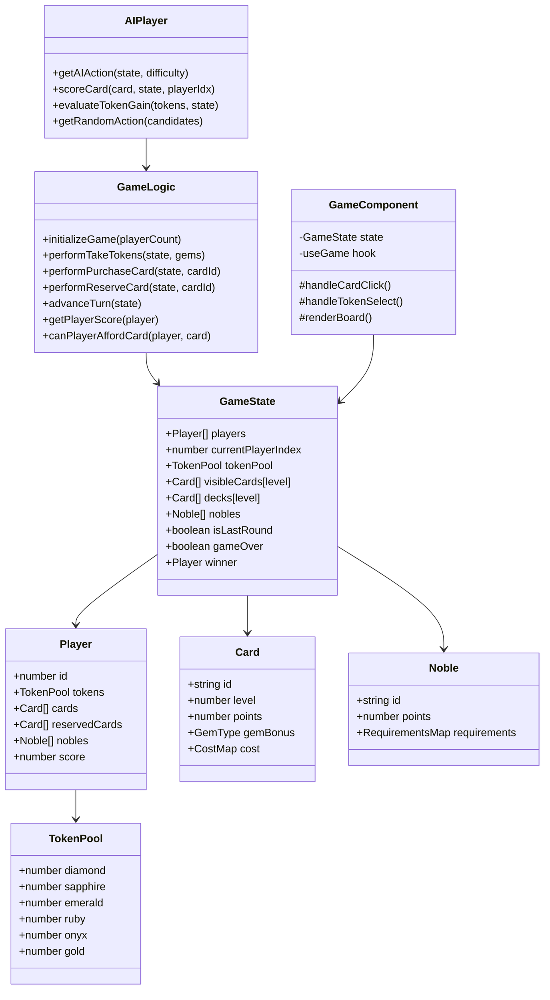

# Gemstone Guilds - System Architecture & Class Diagram

**Last Updated:** May 2, 2026  
**Project:** Gemstone Guilds Multiplayer Card Game Platform

---

## Architecture Overview

This document provides a comprehensive view of the system architecture and class relationships in Gemstone Guilds using UML class diagrams and architectural patterns.

---

## 1. Core Domain Model (Splendor Game)

```
┌─────────────────────────────────────────────────────────────────┐
│                        GAME STATE CORE                          │
└─────────────────────────────────────────────────────────────────┘

                          ┌──────────────┐
                          │  GameState   │
                          ├──────────────┤
                          │ - players[]  │
                          │ - tokenPool  │
                          │ - visibleCards
                          │ - nobles[]   │
                          │ - gameOver   │
                          │ - winner     │
                          └──────────────┘
                                 │
                    ┌────────────┼────────────┐
                    │            │            │
             ┌──────▼─────┐ ┌────▼────┐ ┌───▼──────┐
             │   Player   │ │  Card   │ │  Noble   │
             ├────────────┤ ├─────────┤ ├──────────┤
             │ - id       │ │ - id    │ │ - id     │
             │ - tokens   │ │ - level │ │ - points │
             │ - cards[]  │ │ - cost  │ │ - req[]  │
             │ - nobles[] │ │ - bonus │ └──────────┘
             │ - reserved │ │ - points│
             └────────────┘ └─────────┘

┌─────────────────────────────────────────────────────────────────┐
│                       TOKEN SYSTEM                              │
└─────────────────────────────────────────────────────────────────┘

Tokens: DIAMOND | SAPPHIRE | EMERALD | RUBY | ONYX | GOLD
         └─ Gem Types (5)               └─ Wild/Premium

Card Cost:
  { diamond: 3, sapphire: 2, emerald: 1, ruby: 0, onyx: 0 }
  
Player Bonuses:
  Permanent gem bonuses from collected cards
  Reduces cost requirements for future purchases
```

---

## 2. Game Logic Module

```
┌──────────────────────────────────────────────────┐
│          Game Logic Functions                    │
├──────────────────────────────────────────────────┤
│ + initializeGame(playerCount): GameState        │
│ + performTakeTokens(state, gems): GameState     │
│ + performPurchaseCard(state, cardId): GameState │
│ + performReserveCard(state, cardId): GameState  │
│ + performReturnToken(state, ...): GameState     │
│ + advanceTurn(state): GameState                 │
│ + getPlayerBonuses(player): BonusMap            │
│ + getPlayerScore(player): number                │
│ + canPlayerAffordCard(player, card): boolean    │
│ + getTotalTokens(player): number                │
│ + checkNobleVisit(player): Noble[]              │
│ + checkGameWon(player): boolean                 │
└──────────────────────────────────────────────────┘
           │
           │ uses/validates
           ▼
    ┌──────────────┐
    │ Game Rules   │
    ├──────────────┤
    │ - cardLevels │
    │ - tokenRules │
    │ - noble req  │
    │ - win cond   │
    └──────────────┘
```

---

## 3. AI Player Module

```
┌─────────────────────────────────────────────────────────┐
│                  AIPlayer Module                        │
├─────────────────────────────────────────────────────────┤
│ Type: AIDifficulty = 'easy' | 'medium' | 'hard'        │
│ Type: AIAction                                          │
│   - takeTokens (with specific gems)                     │
│   - purchaseCard (with cardId)                          │
│   - reserveCard (with cardId)                           │
│   - reserveDeck (with level)                            │
├─────────────────────────────────────────────────────────┤
│ - getAIAction(state, difficulty): AIAction             │
│ - getAIActionCandidates(state, diff): AIAction[]       │
│ - scoreCard(card, state, playerIdx): number            │
│ - evaluateTokenGain(tokens, state, playerIdx): number  │
│ - evaluateNobleChance(state, playerIdx): number        │
│ - evaluateReserve(card, state, playerIdx): number      │
│ - getRandomAction(candidates[]): AIAction              │
└─────────────────────────────────────────────────────────┘
           │
           │ uses
           ▼
    ┌──────────────────────┐
    │ Game State Analysis  │
    ├──────────────────────┤
    │ - Card Scoring       │
    │ - Token Evaluation   │
    │ - Noble Tracking     │
    │ - Victory Analysis   │
    └──────────────────────┘
```

---

## 4. React Hook: useGame

```
┌────────────────────────────────────────────────────────┐
│              useGame(playerCount, state)               │
├────────────────────────────────────────────────────────┤
│ State:                                                 │
│   - state: GameState                                   │
│                                                        │
│ Actions (Callbacks):                                   │
│   - takeTokens(gems: GemType[])                        │
│   - purchaseCard(cardId: string | number)              │
│   - reserveCard(cardId, fromDeckLevel?)                │
│   - returnToken(playerIdx, tokenType)                  │
│   - endTurn()                                          │
│   - resetGame(nextState?)                              │
│   - setState(newState)                                 │
├────────────────────────────────────────────────────────┤
│ Hooks Used:                                            │
│   - useState (game state)                              │
│   - useCallback (memoized callbacks)                   │
└────────────────────────────────────────────────────────┘
           │
           │ interacts with
           ▼
    ┌──────────────────┐
    │ Game Logic       │
    │ Functions        │
    └──────────────────┘
```

---

## 5. React Components Hierarchy

```
┌────────────────────────────────────────────────────────────────┐
│                    <App />                                     │
├────────────────────────────────────────────────────────────────┤
│ Routing & Layout                                               │
└────────────────────────────────────────────────────────────────┘
              │
    ┌─────────┼─────────┬──────────────┬────────────┐
    │         │         │              │            │
    ▼         ▼         ▼              ▼            ▼
 <Landing> <Login>  <Game/>      <GamesList/>  <Shop/>
    │         │         │              │            │
    │         │    ┌────┼────┐         │            │
    │         │    │    │    │         │            │
    ▼         ▼    ▼    ▼    ▼         ▼            ▼
 Auth Auth  GameBoard UI  GameState  Lists  ShopItem
 Form          │                                  │
           ┌───┼──────┐                           │
           │   │      │                           │
           ▼   ▼      ▼                           ▼
        Viewport TokenPool CardGrid         CosmticCard

Player Components:
┌─────────────────────────┐
│   PlayerPanel           │
├─────────────────────────┤
│ - PlayerStatus          │
│ - TokenDisplay          │
│ - ReservedCards         │
│ - NobleTracker          │
└─────────────────────────┘

Game UI Components:
┌─────────────────────────┐
│   CardDisplay           │
├─────────────────────────┤
│ - Card Content          │
│ - Purchase Button       │
│ - Reserve Button        │
│ - Cost Indicator        │
└─────────────────────────┘

Online Game Components:
┌─────────────────────────┐
│   OnlineGame            │
├─────────────────────────┤
│ - Matchmaking           │
│ - WebSocket Provider    │
│ - SyncState             │
│ - NetworkStatus         │
└─────────────────────────┘
```

---

## 6. Backend Server Architecture

```
┌─────────────────────────────────────────────────────────────┐
│                   Express.js Server                         │
├─────────────────────────────────────────────────────────────┤
│ - Port: 3001                                                │
│ - Static file serving (frontend)                            │
│ - RESTful API endpoints                                     │
│ - WebSocket (Socket.IO) server                              │
└─────────────────────────────────────────────────────────────┘
              │
    ┌─────────┼──────────┬──────────────┐
    │         │          │              │
    ▼         ▼          ▼              ▼
 Routes   Middleware  Controllers  WebSocket
    │                      │          Handlers
    │                      │              │
    └──────▼──────────────▼──────────────┘
           │
           ▼
    ┌──────────────────┐
    │   Services       │
    ├──────────────────┤
    │ - Auth Service   │
    │ - Game Service   │
    │ - Player Service │
    │ - Shop Service   │
    └──────────────────┘
           │
           ▼
    ┌──────────────────────┐
    │    Database/Store    │
    ├──────────────────────┤
    │ - JSON File (dev)    │
    │ - MongoDB (prod)     │
    │ - Redis Cache        │
    └──────────────────────┘

WebSocket Events:
┌─────────────────────────────────────┐
│  Socket.IO Connection Manager       │
├─────────────────────────────────────┤
│ Events:                             │
│ - playerJoined(gameId, player)      │
│ - playerMoved(gameId, action)       │
│ - gameStateUpdated(gameId, state)   │
│ - playerDisconnected(gameId, id)    │
│ - gameEnded(gameId, winner)         │
│ - chatMessage(gameId, msg)          │
└─────────────────────────────────────┘
```

---

## 7. User Management & Authentication

```
┌──────────────────────────────────────────────────┐
│           Authentication Module                  │
├──────────────────────────────────────────────────┤
│ Components:                                      │
│ - Login/SignUp Forms                             │
│ - JWT Token Management                           │
│ - Password Hashing (bcrypt)                      │
│ - Session Management                             │
└──────────────────────────────────────────────────┘
           │
           ▼
    ┌──────────────────┐
    │    User Model    │
    ├──────────────────┤
    │ - id             │
    │ - username       │
    │ - email          │
    │ - passwordHash   │
    │ - createdAt      │
    │ - lastLogin      │
    │ - preferences    │
    └──────────────────┘
           │
           ├──────────────┐
           ▼              ▼
    ┌───────────┐  ┌─────────────────┐
    │  Profile  │  │  PlayerAccount  │
    ├───────────┤  ├─────────────────┤
    │ - avatar  │  │ - coins         │
    │ - lang    │  │ - gems          │
    │ - region  │  │ - rankPoints    │
    │ - settings│  │ - level         │
    └───────────┘  │ - achievements  │
                   │ - cosmetics[]   │
                   └─────────────────┘
```

---

## 8. Data Models

```
┌─────────────────────────────────────────────────────────┐
│                  Card Model                            │
├─────────────────────────────────────────────────────────┤
│ - id: string                                            │
│ - level: 1 | 2 | 3 (deck level)                        │
│ - cost: { diamond, sapphire, emerald, ruby, onyx }     │
│ - gemBonus: GemType (permanent bonus)                   │
│ - points: number (0-5 victory points)                   │
│ - buyAmount: number (for Noble requirements)           │
└─────────────────────────────────────────────────────────┘

┌─────────────────────────────────────────────────────────┐
│                  Noble Model                           │
├─────────────────────────────────────────────────────────┤
│ - id: string                                            │
│ - points: 3 (fixed)                                    │
│ - requirements: { gem: count, ... }                     │
│   (e.g., { diamond: 4, sapphire: 4 })                  │
└─────────────────────────────────────────────────────────┘

┌─────────────────────────────────────────────────────────┐
│              Player Model (In-Game)                     │
├─────────────────────────────────────────────────────────┤
│ - id: number (0, 1, 2, 3 for 2-4 player games)       │
│ - tokens: { diamond, sapphire, emerald, ruby, onyx,   │
│           gold: numbers }                              │
│ - cards: Card[] (owned cards)                          │
│ - nobles: Noble[] (visited nobles)                     │
│ - reservedCards: Card[] (max 3)                        │
│ - score: number (calculated from cards + nobles)       │
└─────────────────────────────────────────────────────────┘
```

---

## 9. Game Data Module

```
┌─────────────────────────────────────────────┐
│         gameData.ts Constants               │
├─────────────────────────────────────────────┤
│ - GEM_TYPES: array of gem types             │
│ - ALL_CARDS: Card[] (full cardset)          │
│ - ALL_NOBLES: Noble[] (all nobles)          │
│ - GAME_RULES: {                             │
│     maxReserved: 3,                         │
│     targetScore: 15,                        │
│     startingGems: {...},                    │
│     maxGameTokens: {...}                    │
│   }                                         │
│ - Card Level 1 (40 cards)                   │
│ - Card Level 2 (30 cards)                   │
│ - Card Level 3 (20 cards)                   │
│ - Nobles (10 cards)                         │
└─────────────────────────────────────────────┘
```

---

## 10. Hooks & Custom React Logic

```
┌──────────────────────────────┐      ┌──────────────────────────┐
│    useGame Hook              │      │    useAuth Hook          │
├──────────────────────────────┤      ├──────────────────────────┤
│ - manages game state         │      │ - manages user auth      │
│ - game actions callbacks     │      │ - login/signup logic     │
│ - game reset logic           │      │ - token persistence      │
│ - local state management     │      │ - user context           │
└──────────────────────────────┘      └──────────────────────────┘

┌──────────────────────────────┐      ┌──────────────────────────┐
│    useOnlineGame Hook        │      │    useLanguage Hook      │
├──────────────────────────────┤      ├──────────────────────────┤
│ - WebSocket connection       │      │ - i18n state            │
│ - remote player sync         │      │ - language switching    │
│ - network state management   │      │ - translation support   │
│ - reconnection logic         │      │ - localStorage persist  │
└──────────────────────────────┘      └──────────────────────────┘

┌──────────────────────────────┐      ┌──────────────────────────┐
│    useVoiceChat Hook         │      │    useAudio Hook         │
├──────────────────────────────┤      ├──────────────────────────┤
│ - WebRTC initialization      │      │ - background music      │
│ - audio stream management    │      │ - SFX control           │
│ - peer connection setup      │      │ - volume management     │
│ - connectivity monitoring    │      │ - audio preferences     │
└──────────────────────────────┘      └──────────────────────────┘
```

---

## 11. Store/Database Layer

```
┌──────────────────────────────────────────────────┐
│              Storage Abstraction                 │
├──────────────────────────────────────────────────┤
│ Interface:                                       │
│ - getUser(userId): User                         │
│ - saveUser(user): Promise<void>                 │
│ - getGame(gameId): GameState                    │
│ - saveGame(game): Promise<void>                 │
│ - getLeaderboard(): Player[]                    │
│ - getAchievements(userId): Achievement[]        │
│ - getCosmeticItems(): Cosmetic[]                │
│ - updatePlayerStats(userId, stats): Promise    │
└──────────────────────────────────────────────────┘
           │
    ┌──────┴─────────────────┐
    │                         │
    ▼                         ▼
┌─────────────┐      ┌──────────────────┐
│  JSON File  │      │   MongoDB        │
│  (Dev)      │      │   (Production)   │
│             │      │                  │
│ shared-     │      │ - Collections:   │
│ state.json  │      │   * users        │
│             │      │   * games        │
│             │      │   * leaderboards │
│             │      │   * cosmetics    │
└─────────────┘      └──────────────────┘

┌─────────────────────────┐
│    Redis Cache          │
├─────────────────────────┤
│ - Active game states    │
│ - Session data          │
│ - Leaderboard cache     │
│ - User preferences      │
└─────────────────────────┘
```

---

## 12. Component State Flow

```
Global State Flow:

      ┌─────────────────────────────┐
      │   AuthContext Provider      │
      │  (user, isLoggedIn)         │
      └─────────┬───────────────────┘
                │
      ┌─────────┴───────────────────┐
      │                             │
      ▼                             ▼
  Protected                     Public
  Routes                        Routes
    │                             │
    ├─ Home                       ├─ Landing
    ├─ Game                       ├─ Login
    ├─ Shop                       ├─ SignUp
    ├─ Friends                    └─ About
    ├─ Groups
    └─ Account

Local State Flow (Game Page):

  <Game />
    │
    ├─ gameMode (state)
    │   ├─ solo (useGame + useAI)
    │   ├─ online (useOnlineGame)
    │   └─ challenge (useGame + customRules)
    │
    ├─ UI State (useState)
    │   ├─ selectedAction
    │   ├─ hoveredCard
    │   ├─ selectedTokens[]
    │   └─ confirmationModal
    │
    ├─ Audio State (useAudio + useBackgroundMusic)
    │   ├─ bgMusicVolume
    │   ├─ sfxEnabled
    │   └─ voiceChatActive
    │
    └─ Display Components
        ├─ GameBoard (board + viewport)
        ├─ PlayerPanels (status + tokens)
        ├─ ActionPanel (available moves)
        └─ ChatPanel (for multiplayer)
```

---

## 13. API Endpoints (RESTful)

```
Authentication:
  POST   /api/auth/signup      { username, email, password }
  POST   /api/auth/login       { email, password }
  POST   /api/auth/logout      {}
  GET    /api/auth/me          (returns current user)
  POST   /api/auth/refresh     (refresh JWT token)

Player Account:
  GET    /api/player/profile   (current user profile)
  PUT    /api/player/profile   (update profile/settings)
  GET    /api/player/stats     (career stats)
  GET    /api/player/cosmetics (owned cosmetics)

Game Sessions:
  POST   /api/games            (create new game)
  GET    /api/games/:id        (get game state)
  PUT    /api/games/:id/action (process action)

Leaderboard:
  GET    /api/leaderboard/global
  GET    /api/leaderboard/friends
  GET    /api/leaderboard/:game (by game type)

Shop:
  GET    /api/shop/cosmetics   (available items)
  POST   /api/shop/purchase    { itemId, currency }
  GET    /api/shop/bundles     (cosmetic bundles)

Social:
  GET    /api/friends
  POST   /api/friends/:userId  (add friend)
  DELETE /api/friends/:userId  (remove friend)
  GET    /api/groups
  POST   /api/groups           (create group/guild)
  GET    /api/groups/:id
  PUT    /api/groups/:id       (update group)

Matchmaking:
  POST   /api/matchmaking/queue  { gameMode, difficulty }
  DELETE /api/matchmaking/queue  (leave queue)
  GET    /api/matchmaking/status
```

---

## 14. WebSocket Events (Socket.IO)

```
Client → Server:

game:join            { gameId, playerId }
game:action          { gameId, action, playerId }
game:disconnect      { gameId, playerId }
chat:message         { gameId, playerId, message }
voice:start          { gameId, playerId }
voice:end            { gameId, playerId }
player:status        { gameId, playerId, isReady }

Server → Client:

game:started         { gameId, gameState }
game:stateUpdated    { gameId, gameState }
game:playerJoined    { gameId, playerId, player }
game:playerLeft      { gameId, playerId }
game:actionProcessed { gameId, result }
game:ended           { gameId, winner, scores }
chat:received        { gameId, playerId, message }
voice:incomingCall   { gameId, callerId }
error:disconnect     { reason, reconnectUrl }
```

---

## 15. Technology Stack Diagram

```
┌──────────────────────────────────────────────────────────────┐
│                       FRONTEND (Client)                      │
├──────────────────────────────────────────────────────────────┤
│ Framework:        React 18.x + TypeScript                    │
│ Build Tool:       Vite                                       │
│ Styling:          Tailwind CSS + PostCSS                     │
│ Component Lib:    shadcn-ui (Radix UI)                       │
│ State Mgmt:       React Hooks + Context API                  │
│ Form Handling:    React Hook Form + Zod (validation)         │
│ HTTP Client:      Axios/Fetch API                            │
│ WebSocket:        Socket.IO Client                           │
│ Testing:          Vitest + React Testing Library             │
│ i18n:             i18next or similar                         │
│ Audio:            Web Audio API, Howler.js (optional)        │
└──────────────────────────────────────────────────────────────┘
           │                              │
           ▼                              ▼
      IndexedDB                    localStorage
      (game cache)                 (user prefs)

┌──────────────────────────────────────────────────────────────┐
│                       BACKEND (Server)                       │
├──────────────────────────────────────────────────────────────┤
│ Runtime:          Node.js 18+                                │
│ Framework:        Express.js 4.x                             │
│ Language:         TypeScript                                 │
│ WebSocket:        Socket.IO                                  │
│ Database (Dev):   JSON files                                 │
│ Database (Prod):  MongoDB / PostgreSQL                       │
│ Cache:            Redis                                      │
│ Authentication:   JWT (jsonwebtoken)                         │
│ Password:         bcryptjs                                   │
│ Validation:       Joi / Zod                                  │
│ Logging:          Winston / Bunyan                           │
│ Error Tracking:   Sentry                                     │
│ Testing:          Jest + Supertest                           │
│ Deployment:       Docker + Kubernetes / Heroku / AWS        │
└──────────────────────────────────────────────────────────────┘
           │
    ┌──────┼──────┐
    │      │      │
    ▼      ▼      ▼
  HTTP  WebSocket Files (backup)
  API    Events

┌──────────────────────────────────────────────────────────────┐
│                    INFRASTRUCTURE                            │
├──────────────────────────────────────────────────────────────┤
│ DNS:              Cloudflare / Route 53                      │
│ CDN:              Cloudflare / CloudFront                    │
│ Static Hosting:   S3 / Vercel / Netlify                      │
│ Server Hosting:   AWS EC2 / Heroku / DigitalOcean           │
│ Monitoring:       DataDog / New Relic / CloudWatch           │
│ Analytics:        Google Analytics 4                         │
│ Version Control:  Git + GitHub / GitLab                      │
│ CI/CD:            GitHub Actions / GitLab CI                 │
└──────────────────────────────────────────────────────────────┘
```

---

## 16. Design Patterns Used

### 1. **MVC Pattern**
- Models: Data types (Card, Player, Noble, etc.)
- Views: React Components
- Controllers: Game logic functions & API endpoints

### 2. **Hook Pattern (React)**
- useGame: Manages single-player game state
- useOnlineGame: Manages multiplayer sync
- useAuth: Manages authentication state
- useLanguage: Manages i18n state

### 3. **Provider Pattern**
- AuthContext: Provides user/auth state
- GameProvider: Provides game state (optional)
- LanguageProvider: Provides i18n state

### 4. **Service Pattern**
- GameService: Core game logic abstraction
- PlayerService: Player data operations
- AuthService: Authentication operations
- ShopService: Shop/cosmetics operations

### 5. **Observer Pattern**
- Socket.IO events (pub-sub model)
- React state updates (subscribers)
- WebRTC peer connections

### 6. **Factory Pattern**
- AIPlayer difficulty levels
- Game mode initialization
- Component creation (Card, Noble, etc.)

### 7. **Strategy Pattern**
- AIPlayer strategies by difficulty
- Token selection strategies
- Card evaluation strategies

### 8. **Command Pattern**
- Game actions (takeTokens, purchaseCard, etc.)
- Undoable operations (future)
- Action replay system

---

## 17. Data Flow Examples

### Example 1: Card Purchase Flow

```
User clicks "Purchase Card" button
        │
        ▼
CardDisplay component triggers callback
        │
        ▼
purchaseCard(cardId) from useGame hook
        │
        ▼
performPurchaseCard(state, cardId) in gameLogic.ts
        │
        ├─ Find card in visible or reserved
        ├─ Verify afford (canPlayerAffordCard)
        ├─ Deduct tokens from pool
        ├─ Add card to player.cards
        ├─ Check noble visits
        ├─ Check game won condition
        └─ Emit socket event (if online)
        │
        ▼
setState(newState) updates React state
        │
        ▼
Components re-render with new board state
        │
        ▼
User sees card removed from display
User sees card added to their collection
User sees tokens updated
```

### Example 2: Online Game Multiplayer Flow

```
Player 1 clicks action button
        │
        ▼
useOnlineGame triggers socket emit
        │
        ▼
Server receives "game:action" event
        │
        ├─ Validate action legitimacy
        ├─ Process action same as single-player
        ├─ Broadcast "game:stateUpdated" to all players
        └─ Persist to database
        │
        ▼
Player 2 receives socket event
        │
        ▼
useOnlineGame updates local state
        │
        ▼
Components re-render with synced state
        │
        ▼
Player 2 sees Player 1's move result
```

---

## 18. Scalability Considerations

```
Current Architecture (Single Server):
┌─ Frontend (React SPA)
├─ Backend (Express.js)
├─ Database (MongoDB)
└─ Cache (Redis)

Future: Load Balanced Microservices
┌─ CDN Edge (Static assets)
├─ Load Balancer (nginx/HAProxy)
├─ Game Service (cluster)
├─ Auth Service (dedicated)
├─ Shop Service (dedicated)
├─ Matchmaking Service (dedicated)
├─ Database (MongoDB sharded/replicated)
├─ Cache Cluster (Redis cluster)
└─ Message Queue (RabbitMQ/Kafka for events)
```

---

## 19. Security Architecture

```
Request Flow with Security:

Client Request
    │
    ▼
HTTPS/TLS Encryption
    │
    ▼
CORS Validation
    │
    ▼
Rate Limiting
    │
    ▼
JWT/Session Auth
    │
    ▼
Input Validation (Zod/Joi)
    │
    ▼
Authorization Checks
    │
    ▼
Database Query (parameterized)
    │
    ▼
Response
    │
    ├─ Remove sensitive data
    └─ Apply security headers
```

---

## Mermaid Class Diagram



---

## 20. Database Schema

```
USERS Collection:
{
  _id: ObjectId
  username: String (unique)
  email: String (unique)
  passwordHash: String
  createdAt: DateTime
  updatedAt: DateTime
  preferences: {
    language: String
    audioEnabled: Boolean
    notificationsEnabled: Boolean
  }
}

PLAYER_ACCOUNTS Collection:
{
  _id: ObjectId
  userId: ObjectId (ref USERS)
  coins: Number
  gems: Number
  rankPoints: Number
  level: Number
  totalGamesPlayed: Number
  achievements: Array
  ownedCosmetics: Array
  stats: {
    winRate: Number
    totalPlayed: Number
    avgGameLength: Number
  }
}

GAME_RECORDS Collection:
{
  _id: ObjectId
  gameId: String
  gameMode: String (solo, online, challenge)
  players: Array[{
    playerId: String
    playerName: String
    finalScore: Number
  }]
  winner: ObjectId (ref PLAYER_ACCOUNTS)
  startedAt: DateTime
  endedAt: DateTime
  gameDuration: Number
  moves: Array (replay data)
}

COSMETICS Collection:
{
  _id: ObjectId
  name: String
  type: String (cosmetic, card-back, table-theme)
  rarity: String (common, rare, epic, legendary)
  price: {
    coins: Number
    gems: Number
  }
  image: String (URL)
  createdAt: DateTime
}

LEADERBOARD Collection:
{
  _id: ObjectId
  playerId: ObjectId (ref PLAYER_ACCOUNTS)
  rank: Number
  rankPoints: Number
  gameMode: String
  lastUpdated: DateTime
}
```

---

## Document History

| Version | Date | Author | Changes |
|---------|------|--------|---------|
| 1.0 | May 2, 2026 | AI Assistant | Initial architecture & class diagram documentation |
| | | | |

---

*This architecture is designed to be scalable and maintainable. Regular reviews recommended as the project grows.*
